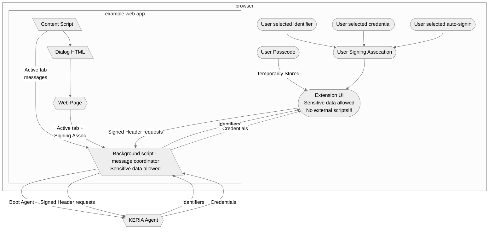

```mermaid
%%{init: {'theme':'neutral'}}%%
graph
    subgraph browser
    EXTUI([Extension UI\nSensitive data allowed\nNo external scripts!!!])-- Signed Header requests -->BSCRIPT[\Background script - message coordinator\nSensitive data allowed\]
    SIGN([User Signing Assocation]) --> EXTUI
    AID([User selected identifier]) --> SIGN
    CRED([User selected credential]) --> SIGN
    AUTO([User selected auto-signin]) --> SIGN
    PASS([User Passcode])--Temporarily Stored-->EXTUI
        subgraph example web app
        CONTENT[\Content Script\]-- Active tab\nmessages-->BSCRIPT;
        WEBPG{{Web Page}}-- Active tab +\nSigning Assoc-->BSCRIPT;
        CONTENT --> DIALOG[\Dialog HTML\];
        DIALOG --> WEBPG;
        end
    end
    BSCRIPT-- Boot Agent -->AGENT{{KERIA Agent}};
    BSCRIPT-- Signed Header requests -->AGENT{{KERIA Agent}};
    AGENT{{KERIA Agent}}-- Identifiers -->BSCRIPT;
    AGENT{{KERIA Agent}}-- Credentials -->BSCRIPT;

    BSCRIPT-- Identifiers -->EXTUI;
    BSCRIPT-- Credentials -->EXTUI;
```